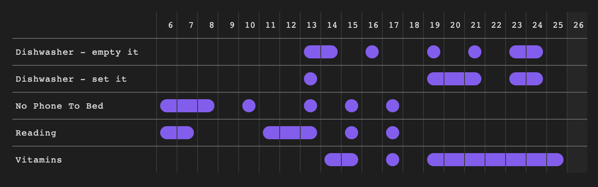

[](https://github.com/zoreet/habit-tracker/releases)
[](https://makeapullrequest.com)
[](https://github.com/prettier/prettier)

<a href="https://buymeacoffee.com/zincplusplus" target="_blank"></a>

# Habit Tracker 21

Introducing "Habit Tracker 21," an innovative plugin designed specifically for Obsidian. Have you ever wanted to develop new habits but struggled to keep yourself accountable? This plugin is your perfect solution.

"Habit Tracker 21" is built on the principle that it takes 21 days to form a new habit. With this tool, tracking your habits becomes a seamless process. It allows you to monitor your progress, providing a clear visualization of your commitment and consistency. It's a great way to motivate yourself as you see the habits you're forming over time.

## How it works

1. Create a folder for all your habits, e.g. `Habits`
2. Create empty files inside that folder for each habit you want to track
3. Enable the habit tracker UI by pasting the following code in your `.md` file:

````markdown
```habittracker
{
	"path": "Habits/"
}
```
````

Make sure to specify the path you're using. You can point to one habit, or all habits that contain that path (including subfolders);

## Parameters

- **path** _[mandatory]_: a string containing a path to a folder or specific habit (aka .md file)

- **lastDisplayedDate** _[optional]_: the date that is displayed in the chart

  - format: `"YYYY-MM-DD"`
  - defaults to today
  - example settings
    `{
	"path": "Habits/",
	"lastDisplayedDate": "2023-12-27"
}`

- **daysToShow** _[optional]_: how many dates to display in the chart

  - default: `21`

  `{
	"path": "Habits/",
	"daysToShow": "31"
}`

## Example




## Tracking

To determine how much time I should invest in this project I use Bitly.com to track how many people use it. This is what I see https://github.com/zoreet/habit-tracker/issues/32#issuecomment-2116918725

This is the tracker that collects the least ammount of data that I could find, other than building a custom one. If you have any concerns please add a comment to the above ticket.


## Support

If you enjoy this plugin consider buying me a coffee at https://buymeacoffee.com/zincplusplus
