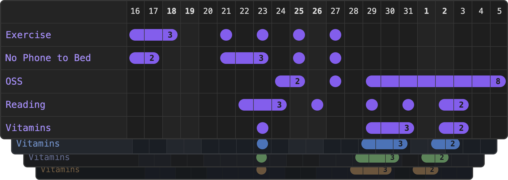

# Habit Tracker 21 [](https://obsidian.md) [](https://www.buymeacoffee.com/zincplusplus)  [](https://github.com/zincplusplus/habit-tracker/releases)  [](https://github.com/zincplusplus/habit-tracker/pulls)

A minimalist, elegant habit tracker for [Obsidian](https://obsidian.md) that helps you build lasting habits with clear progress visualization.

Transform your [Obsidian](https://obsidian.md) vault into a habit-building powerhouse. Track daily habits with an intuitive grid interface, customize your tracking experience, and watch your consistency streaks grow over time.



## Features

- **Minimalist Look** - Elegant, clean interface with nothing but essential functionality. Matches your theme effortlessly using Obsidian CSS variables
- **Maximum configurability** - You can tweak and customize pretty much every aspect of Habit Tracker 21 to make it just right for you
- **Easy to setup** - Matches your theme effortlessly using Obsidian CSS variables and includes sensible defaults for all tracker properties
- **Smart Folder Support** - Track individual files or entire habit folders
- **Flexible Streak Counting** - Optional gap tolerance (`maxGap`) keeps streaks intact across short breaks while counting only days you actually completed
- **Daily Note Integration** - Click any date in the header to jump straight to your daily note for that day
- **Contribution Graph Mode** - Switch to a GitHub-style contribution graph view for a different way to visualize your habits
- **Debug Mode** - Comprehensive debugging gives you all the info you need to figure it out

## Quick Start

1. Install the plugin from **[Obsidian's Community Plugins](obsidian://show-plugin?id=habit-tracker-21)**
2. **Create your habits folder** (e.g., `Habits/`)
3. **Add habit files** like `Exercise.md`, `Reading.md` for each habit you want to track
4. **Insert tracker** in your Daily notes template, or any other file:

````markdown
```habittracker
{
  "path": "Habits"
}
```
````

That's it! Click the grid to log your daily habits.

## Customization

### Custom Habit Titles

By default, habit titles use the filename (e.g., `Exercise.md` → "Exercise"). Customize titles by adding frontmatter to your habit files:

```markdown
---
title: "Morning Workout 💪"
entries: []
---
```

Examples:
- `title: "📚 Daily Reading"`
- `title: "Drink 8 glasses of water"`
- `title: "Meditation & Mindfulness"`

If no title is specified, the filename is used as before.

### Custom Habit Colors

By default, habit colors inherit from your Obsidian theme's checkbox ticked color. Personalize individual habits with custom colors by adding a `color` property to your habit file frontmatter:

```markdown
---
title: "Morning Workout 💪"
color: "#4CAF50"
entries: []
---
```

Examples:
- `color: "#FF5722"` (hex colors)
- `color: "rgb(76, 175, 80)"` (RGB values)
- `color: "green"` (CSS color names)

Invalid colors are ignored and the default theme color is used.

### Streak Gap Tolerance

By default, a single missed day breaks a streak. Use `maxGap` to keep a streak visually intact across short gaps — useful for habits where occasional misses are acceptable (e.g. a rest day in a workout routine):

```markdown
---
title: "Morning Workout 💪"
maxGap: 1
entries: []
---
```

- The streak bar renders continuously across gap days (shown at reduced opacity)
- The streak **count** reflects only actual ticked days — gap days are not counted
- `maxGap: 1` allows 1 missed day, `maxGap: 2` allows 2, and so on

**Examples by habit frequency:**

| Habit | Frequency | `maxGap` | Why |
| ----- | --------- | -------- | --- |
| Workout | 3× per week | `3` | Allows up to 3 rest days between sessions (e.g. Mon → Fri) |
| Clean Puramax | Every 2 weeks | `13` | Up to 13 days can pass between cleanings |
| Call a friend or family member | Weekly | `6` | One call per week, any day |
| Car service / deep clean | Monthly | `30` | Up to 30 days between occurrences |

## Configuration

### Global Settings

Access via **Settings > Community plugins > Habit Tracker** to set defaults for all trackers:

- **Default Path** - Choose from dropdown of vault folders
- **Days to Show** - Number input (default: 21)
- **Show Streaks** - Toggle streak indicators and counts on/off (default: on)
- **Open daily note on date click** - Click a date in the header row to open the corresponding daily note (default: on). Requires the Daily Notes core plugin or the Periodic Notes community plugin
- **Display Mode** - Choose between "Default" (grid) and "Contribution Graph" (GitHub-style graph). Can be overridden per-tracker with `"mode"` in code blocks
- **Debug Mode** - Toggle debug output on/off
- **Match Line Length** - Fit tracker to readable line width

### Per-Tracker Settings

Override global settings in individual code blocks:

````markdown
```habittracker
{
  "path": "Habits",
  "daysToShow": 30,
  "lastDisplayedDate": "2024-01-15",
  "debug": true,
  "matchLineLength": false
}
```
````

## All Settings

### Per-Tracker Settings (code block)

| Setting             | Type    | Default | Description                                                                      |
| ------------------- | ------- | ------- | -------------------------------------------------------------------------------- |
| `path`              | string  | "/"     | Path to habit folder or file. Defaults to root folder if left empty              |
| `firstDisplayedDate`| string  | auto    | First date shown in grid (format: "YYYY-MM-DD"). When provided, takes priority over daysToShow |
| `lastDisplayedDate` | string  | today   | Last date shown in grid (format: "YYYY-MM-DD"). If left empty, defaults to today |
| `daysToShow`        | number  | 21      | Number of days to display. Ignored when firstDisplayedDate is explicitly provided |
| `color`             | string  | ""      | Custom color for this tracker (hex, RGB, or CSS color name)                     |
| `showStreaks`       | boolean | true    | Display streak indicators and counts                                             |
| `debug`             | boolean | false   | Enable debug console output                                                      |
| `mode`              | string  | "default" | Display mode: `"default"` for grid view, `"graph"` for GitHub-style contribution graph |
| `matchLineLength`   | boolean | false   | Match readable line width                                                        |

### Per-Habit Settings (frontmatter)

| Setting   | Type   | Default | Description                                                                                  |
| --------- | ------ | ------- | -------------------------------------------------------------------------------------------- |
| `title`   | string | ""      | Custom display name. Falls back to filename if not set                                       |
| `color`   | string | ""      | Custom color for this habit (hex, RGB, or CSS color name)                                    |
| `maxGap`  | number | 0       | Allow up to N consecutive missed days within a streak. Gap days show at reduced opacity; only actual ticked days are counted |
| `entries` | array  | []      | Array of completed dates in YYYY-MM-DD format. Managed automatically when clicking the grid  |

## Usage Examples

### Multiple Habits (Most popular)

Track all habits in a folder:

````markdown
```habittracker
{
  "path": "Habits"
}
```
````

### Single Habit

Track one specific habit file:

````markdown
```habittracker
{
  "path": "Habits/Exercise.md"
}
```
````

### Custom Time Range

Show last 30 days:

````markdown
```habittracker
{
  "path": "Habits",
  "daysToShow": 30
}
```
````

### Custom Tracker Color

Override default color for entire tracker:

````markdown
```habittracker
{
  "path": "Habits",
  "color": "#FF5722"
}
```
````

### Streak Gap Tolerance

Allow up to 1 missed day without breaking a streak:

````markdown
```habittracker
{
  "path": "Habits/Exercise.md"
}
```
````

```markdown
---
title: "Exercise"
maxGap: 1
entries: []
---
```

### Disable Streaks

Hide streak indicators for cleaner view:

````markdown
```habittracker
{
  "path": "Habits",
  "showStreaks": false
}
```
````

### View Past Date Range

Show habits ending on a specific date:

````markdown
```habittracker
{
  "path": "Habits",
  "lastDisplayedDate": "2024-01-15",
  "daysToShow": 30
}
```
````

### Show Specific Date Range

Track habits for the entire month of November 2024:

````markdown
```habittracker
{
  "path": "Habits",
  "firstDisplayedDate": "2024-11-01",
  "lastDisplayedDate": "2024-11-30"
}
```
````

### Contribution Graph Mode

Display habits as a GitHub-style contribution graph:

````markdown
```habittracker
{
  "path": "Habits",
  "mode": "graph"
}
```
````

### Debug Mode

Enable detailed logging:

````markdown
```habittracker
{
  "path": "Habits",
  "debug": true
}
```
````

## Troubleshooting

### Common Issues

**"Path is required" error**

- Set a default path in plugin settings, or specify `"path"` in your tracker

**Tracker shows "No habits found"**

- Check the path exists in your vault
- Ensure folder contains `.md` files (subfolders are ignored)

**Settings not updating**

- Trackers auto-refresh when global settings change
- For JSON errors, check syntax (commas, quotes, braces)
- If issues persist, try force reload (Ctrl+R) or restart Obsidian

**Clicking a date does nothing**

- Ensure **Open daily note on date click** is enabled in plugin settings
- Ensure either the **Daily Notes** core plugin or the **Periodic Notes** community plugin is enabled — if neither is active, a notice will appear when you click

**Debug Output**
Enable debug mode to see detailed logging in the browser console (F12).

## Development

### Installation

```bash
git clone https://github.com/zincplusplus/habit-tracker
cd habit-tracker
npm install
npm run dev
```

### Contributing

PRs welcome! Please:

- Follow existing code style
- Update documentation

<a href="https://www.buymeacoffee.com/zincplusplus" target="_blank"></a>

## License

MIT License - see [LICENSE](LICENSE) for details.

---

**Made with ❤️ for the Obsidian community**
